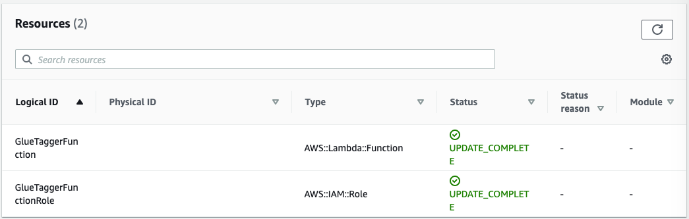
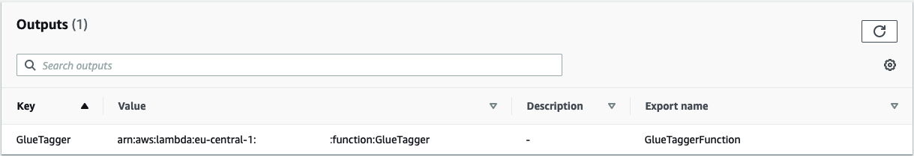

# AWS Glue Tagger

All CloudFormation stack-level tags, including automatically created tags, are propagated to resources that CloudFormation supports. AWS Glue resources do not support this feature at the moment. By using AWS Glue Tagger, you benefit from proper tagging on all of your AWS Glue resources which allows you to have better tracking of costs & resource allocation in your AWS accounts. AWS Glue Tagger automatically propagates tags from your CloudFormation stacks to the AWS Glue resources that you specify. Alternatively, you can override the stack tags by providing specific tags that you want to use to tag your AWS Glue resources. AWS Glue Tagger also supports adding/updating tags of AWS Glue resources without the need to change the resource itself. 

## **Usage**

There are the following ways AWS Glue Tagger can be deployed and used (keep in mind that the GlueTaggerFunction itself can de deployed only once):

1. Deploy manually to your AWS account with one click via the [Serverless Application Repository](https://serverlessrepo.aws.amazon.com/applications/us-east-1/621462903008/aws-glue-tagger).
2. Or include the following resource in your AWS CloudFormation stack with the resources you want to tag (see examples/test_stack_including_sar.yaml):
```yaml
# Add SAR application to your stack. 
AWSGlueTagger:
  Type: AWS::Serverless::Application
  Properties:
    Location:
      SemanticVersion: 1.0.0
      ApplicationId: arn:aws:serverlessrepo:us-east-1:621462903008:applications/aws-glue-tagger
```
3. Or create a standalone AWS CloudFormation stack to reuse across different stacks (see examples/test_stack_only_sar.yaml, examples/test_stack_via_import.yaml).

After it's deployment, the SAR application creates a nested stack that provisions the following resources and outputs:




These are:

  * Resource - AWS Lambda Function - GlueTaggerFunction
  * Resource - AWS IAM Role - GlueTaggerFunctionRole
  * Output - Stack Export Name - GlueTaggerFunction (contains GlueTaggerFunction Arn)

## **Tagging AWS Glue Resources**

Once the SAR application is deployed in the AWS account, you can add Custom Resources (CRs) to your CloudFormation stacks or CDK applications to leverage the tagging functionality from the SAR application to tag your resources. You can provide 3 properties to the CR. These are:

  * **ServiceToken (required)**: The service token which references the GlueTaggerFunction Arn.
  * **ResourceArn (required)**: The list of AWS Glue resource Arns to be tagged.
  * **Tags (optional)**: When provided, stack tags will be omitted and the specified Tags in this property will be applied to the resources defined in ResourceArn.

By default, the CR propagates the parent stack tags to the resources provided in the `ResourceArn` property. When the `Tags` property is specified, the parent stack tags are overriden and the specified `Tags` are used instead. The following example propagates the parent stack tags to the AWS Glue Job `MyJob1`:

```yaml
# Create Custom Resource (CR) to tag Glue resources (propagate parent stack tags)
# NOTE: Use !ImportValue GlueTaggerFunction as ServiceToken for the CR if the CR is in a different stack than the SAR application
# NOTE: Use !GetAtt AWSGlueTagger.Outputs.GlueTagger as ServiceToken for the CR if the CR is within the same stack as the SAR application
GlueTaggerTestStack:
  Type: 'Custom::GlueTaggerTestStack'
  DependsOn:
    - 'MyJob1'
    - 'AWSGlueTagger'
  Properties:
    ServiceToken: !ImportValue GlueTaggerFunction
    ResourceArn:
      - !Sub 'arn:aws:glue:${AWS::Region}:${AWS::AccountId}:job/${MyJob1}'
```

The following example overrides the parent stack tags and propagates the specified tags to the resources:

```yaml
# Create Custom Resource (CR) to tag Glue resources (propagate specified tags in Custom Resource)
# NOTE: Use !ImportValue GlueTaggerFunction as ServiceToken for the CR if the CR is in a different stack than the SAR application
# NOTE: Use !GetAtt AWSGlueTaggerLogicalID.Outputs.GlueTagger as ServiceToken for the CR if the CR is within the same stack as the SAR application
GlueTaggerTestStack:
  Type: 'Custom::GlueTaggerTestStack'
  DependsOn:
    - 'MyJob1'
    - 'AWSGlueTagger'
  Properties:
    ServiceToken: !ImportValue GlueTaggerFunction
    ResourceArn:
      - !Sub 'arn:aws:glue:${AWS::Region}:${AWS::AccountId}:job/${MyJob1}'
    Tags:
      - 'cost_id=0000'
      - 'owner=myorg'
```
You can find a complete example under [examples/test_including_stack.yaml](examples/test_stack_including_sar.yaml). If you want to deploy the test stack to your AWS accout, you can issue the following commands in your CLI. 

**NOTE:** Please make sure to: 
  * have the correct access keys and permissions set in your CLI session for the AWS account where you want to deploy the test stack
  * have an S3 bucket which can be used by CloudFormation to store assets during the `aws cloudformation package` process

```bash
cd examples

# Package test stack template
aws cloudformation package \
  --template-file test_stack_including_sar.yaml \
  --output-template-file packaged_test_stack.yaml \
  --s3-bucket <BUCKET_NAME>

# Deploy test stack
aws cloudformation deploy \
  --template-file packaged_test_stack.yaml \
  --stack-name test-glue-tagger-stack \
  --capabilities CAPABILITY_IAM CAPABILITY_AUTO_EXPAND \
  --tags cost_id=0000
```

## Development

If you would like to deploy the AWS Glue Tagger resources to your AWS account directly from the project repo (not via SAR), you can run the `deploy.sh` script in the project root. 

**NOTE:** Please make sure to: 
  * Have the correct access keys and permissions set in your CLI session for the AWS account where you want to deploy the test stack
  * Have an S3 bucket which can be used by CloudFormation to store assets during the `aws cloudformation package` process within `deploy.sh`
  * Note: S3 bucket must be in the same region as where the stack will be deployed
  * Use the following environment variables to specify where assets will be stored: S3_BUCKET_ASSETS, S3_PREFIX_ASSETS
  * Execute `deploy.sh` passing values, for example `S3_BUCKET_ASSETS=... S3_PREFIX_ASSETS=... ./deploy.sh`

To contribute to this project please see [CONTRIBUTING](CONTRIBUTING.md#security-issue-notifications) for more information.

## Security

See [CONTRIBUTING](CONTRIBUTING.md#security-issue-notifications) for more information.

## License

This library is licensed under the MIT-0 License. See the LICENSE file.
